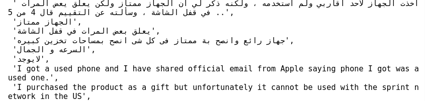
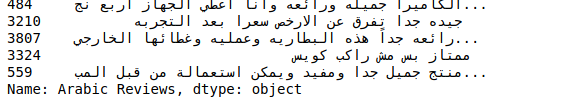
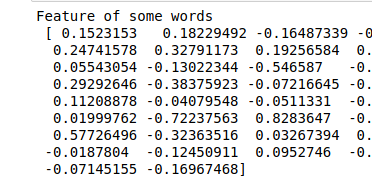

# Arabic Sentiment Analysis

The sentiment behind reviews is a Web application that help users get intuition about the product they intend to buy from online stores.

## Project Structure

- [Scraping Notebook ](https://github.com/Abdelrahmanrezk/Sentiment-Behind-Reviews/blob/master/Sentiment_behind_reviews/scraping_cleaning/Souq_scrapping_multithreading.ipynb)
-  [Cleaning Data Notebook ](https://github.com/Abdelrahmanrezk/Sentiment-Behind-Reviews/blob/master/Sentiment_behind_reviews/scraping_cleaning/cleaning_data.ipynb)
- [Different features enginnering & Modeling Notebook ](https://github.com/Abdelrahmanrezk/Sentiment-Behind-Reviews/tree/master/Sentiment_behind_reviews/features_extractions)
-  [web Application ](https://github.com/Abdelrahmanrezk/Sentiment-Behind-Reviews/tree/master/gradution_project)
-  [Project Report ](https://github.com/Abdelrahmanrezk/Sentiment-Behind-Reviews/blob/master/Graduation%20Report/Abdelrahman_rezk_1551310668__TM471_Project_Final_Report.pdf)
- [Project Video ](https://drive.google.com/file/d/1IiAprp0YlMfMyLSztVpQ9J254ygj29zY/view)

## install requirements

Go to "Graduation Report" folder then write interminal:

- pip install -r requirements.txt

### Quick intuition 

### Test Client Review, Retrive Product and predict Senitment of all reviews

  
   

### Scraping Data

**Structure of the Scrapping I used:**
- loading packages we need.
- path the work dir.
- connect to cloud mongodb database: some variables defined in souq_configs file.
- handle some firefox preference and options that help us during process of scrapping
- at and scraping the products
- others files like cleaning and features engineering work on these scraped data, actually on  reviews of products
- testing some of functions

### snapshot of Main feature function

### snapshot of one_product_reviews function

## Cleaning Data

### more that 5000 scraped products and 100000 Arabic & English reviews

**Welcome to second stage of cleaning scraped reviews, what in this notebook:**

    
### Pipline Cleaning process Structure**

- Convert all reviews to lower case # for English Reviews
- remove punctuations of all reviews
- remove stop words # I found its so bad to remove stop words because its convert the meaning of the sentense at all but I have Designed my own stopwords for this project because of sentment analysis issues
- spell correction
- Tokenization
- Steaming
- Lemmatization

## some snapshots of output and handling issues

## features enginnering & Modeling

For each features engineering process like tf-idf and countVectorizer, I separate each of them to its own file with models based on the feature I used.

### One Hot Encoding
**Encoding categorical data:**

- convert_string_to_one_hot_manual
- convert_string_to_one_hot_using_pannds
- convert_string_to_labelencoder_using_sklearn

### CountVectorizer
**Text data requires special preparation before you can start using it for predictive modeling**

### Pipline of CountVectorizer
- Read our classified file
- Shuffle the data
- split the data to train and testing
- count_vectorize
- model training and testing

### Modeling

**MultinomialNB naive_bayes**

- f1_score: 0.93 Train & 0.86 Testing

**LogisticRegression**

- f1_score: 0.91 Train & 0.89 Testing

**SVC Linear**

- f1_score: 0.96Train & 0.88 Testing

### TfidfVectorizer
**Text data requires special preparation before you can start using it for predictive modeling**

### Pipline of CountVectorizer
- Read our classified file
- Shuffle the data
- split the data to train and testing
- count_vectorize
- model training and testing
### Modeling

**MultinomialNB naive_bayes**

- f1_score: 0.840 Train & 0.841 Testing

**LogisticRegression**

- f1_score: 0.89 Train & 0.90 Testing

**SVC Linear**

- f1_score: 0.93 Train & 0.90 Testing

**SVC poly 2**

- f1_score: 0.80 Train & 0.82 Testing

**SVC poly 2**

- f1_score: 0.80 Train & 0.82 Testing Also !!

### word2vec
**Word embeddings are a type of word representation that allows words with similar meaning to have a similar representation.**

### Pipline of CountVectorizer
- Read our classified file
- Shuffle the data
- get greatest length from our data for padding
- split each review to list of words
- word2vec features extraction
- display the data after Dimension reduction
- build word_2_vec_matrix for training and testing
- model training and testing

### Modeling

**LogisticRegression**

- f1_score: 0.84 Train & 0.83 Testing

**SVC Linear**

- f1_score: 0.84 Train & 0.83 Testing

## some snapshots of output for features enginnering

### One Hot Encoding

### Countvectorizer

### TF-IDF

### Word2vec

## Reviews Handling

**based on the problems of Sentimen Classifcation some of reviews file have muliple columns like:**
- 'reviews.dateAdded' 
- 'reviews.dateSeen'
- others columns

but we just interset in two columns the text review and the rate of each review.

So here is a function that handle these problems and return the reviews with two columns.

### Pipline Reviews Handling Structure

- Function to compine the returned data frames to one data frame
- Another Function to shuffle the reviews of the returned combined data frame**
- Another Function to convert the data frame to csv file
- handle classifed reviews

### Web Application

After what we have discussed in all of these processes we end up with what the user can see now. The Sentiment behind reviews is designed to get products from online stores like Souq & Jumia to make analytical reviews of these products and predict  the  Sentiment  of  each  review  on  the  product  (Positive  Or  Negative), besides a pie chart that represents a quick overview of the ratio between positive and negative.

