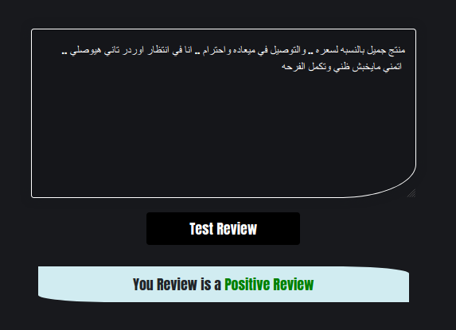
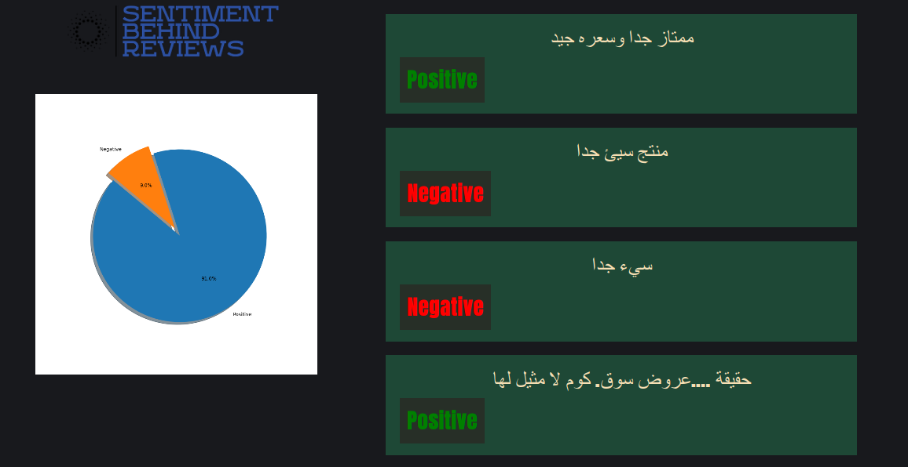
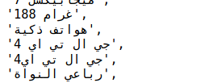
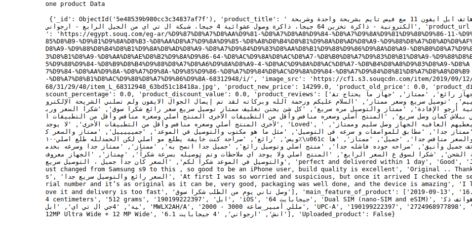
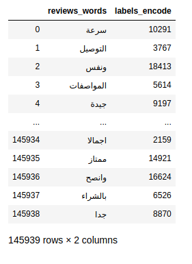
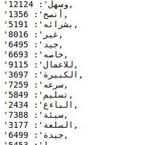
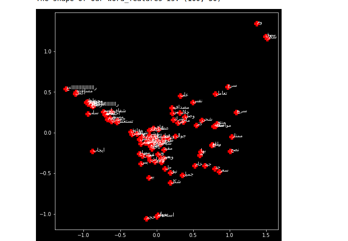

# Arabic Sentiment Analysis

The sentiment behind reviews is a Web application that help users get intuition about the product they intend to buy from online stores.

**Each Notebook has its own explanation of functions in more details.**

## Project Structure

- [Scraping Notebook ](https://github.com/Abdelrahmanrezk/Sentiment-Behind-Reviews/blob/master/Sentiment_behind_reviews/scraping_cleaning/Souq_scrapping_multithreading.ipynb)
-  [Cleaning Data Notebook ](https://github.com/Abdelrahmanrezk/Sentiment-Behind-Reviews/blob/master/Sentiment_behind_reviews/scraping_cleaning/cleaning_data.ipynb)
- [Different features enginnering & Modeling Notebook ](https://github.com/Abdelrahmanrezk/Sentiment-Behind-Reviews/tree/master/Sentiment_behind_reviews/features_extractions)
-  [web Application ](https://github.com/Abdelrahmanrezk/Sentiment-Behind-Reviews/tree/master/gradution_project)
-  [Project Report ](https://github.com/Abdelrahmanrezk/Sentiment-Behind-Reviews/blob/master/Graduation%20Report/Abdelrahman_rezk_1551310668__TM471_Project_Final_Report.pdf)
- [Project Video ](https://drive.google.com/file/d/1IiAprp0YlMfMyLSztVpQ9J254ygj29zY/view)

## install requirements

Go to "Graduation Report" folder then write interminal:

- pip install -r requirements.txt

### Quick intuition 

**Test Client Review, Retrive Product and predict Senitment of all reviews**

  
   

## Model Evaluation
|Model & Features Engineer | CountVectorizer | TF-IDF | Word2Vec |
| :---: | :---: | :---: | :---: |
| Logistic Regression | 89 | 90 | 83 |
| SVC Linear | 88 | 90 | 83 |
| MultinomialNB | 86 | 84.1 |  |

### The remain of notebook put you on the notebooks structure

**Structure of the Scrapping & cleaning:**
- connect to cloud mongodb database: some variables defined in souq_configs file.
- handle some firefox preference and options that help us during process of scrapping
- others files like cleaning and features engineering work on these scraped data, actually on  reviews of products
- testing some of functions
- remove punctuations of all reviews
- remove stop words
- spell correction
- Tokenization
- Lemmatization

### snapshots Output

  
  

## Differet features enginnering & Modeling
- Binary BOW
- CountVectorizer BOW
- TF-IDF BOW 
- Word2Vec
- LogisticRegression
- SVC Linear
- MultinomialNB naive_bayes

## snapshots Outputs

  
  
  

### Pipline Reviews Handling Structure

- Function to compine the returned data frames to one data frame
- Another Function to shuffle the reviews of the returned combined data frame**
- Another Function to convert the data frame to csv file
- handle classifed reviews

### Web Application

After what we have discussed in all of these processes we end up with what the user can see now. The Sentiment behind reviews is designed to get products from online stores like Souq & Jumia to make analytical reviews of these products and predict  the  Sentiment  of  each  review  on  the  product  (Positive  Or  Negative), besides a pie chart that represents a quick overview of the ratio between positive and negative.

